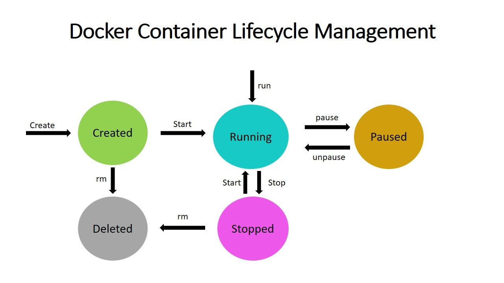

# Container Schulung 
mit Thomas Hanke & Jasmin Fikus

- Part 1: Podman & Docker
- Part 2: Container As A Service Kubernetes)

### Verwendete Links

| Link | Beschreibung |
| ----------- | ----------- |
| [Hub.Docker](https://hub.docker.com/) | Hier holt sich Docker seine Images |
| [Sematic Versioning](https://semver.org/lang/de/) | Standartisierung bei Versionierungen | 


## WörterWolke
Docker - Podman
Kubernetes - Open Shift - Swarm
Image - Container
YAML - Namespace - Skalierung
"Security"

Docker läuft als Root-Daemon, wenn ich also Docker aufrufe, werde ich Root. Podman ist "rootless". Es läuft also mit den Rechten, mit denen ich starte. 

## Fork Exec Model

Bei Fork wird das Programm in einem neuem Prozess gestartet. Sollte es fertig sein, oder beendet werden, übernimt der Parent-Prozess.
Bei Fork wird das Programm in einem neuem Prozess gestartet. Sollte das Programm dann geschlossen werden, gibt es kein Parent-Prozess der übernemen könnte.

## Skalierung

- vertikale Skalierung: Mehr CPU Power, mehr Memory
- horizontale Skalierung: Mehr Rechner, mehr Server

## Sicherheit

- CVE : Common Vunerable Exposiure - BEKANNTE Epxloits und Bugs
- CVSS: Common Vunerable Scoring System - Bewertung dieser Fehler.

## Versionierung

[Sematic Versioning](https://semver.org/lang/de/) dient der eindeutigen Versionierung von Software.
- `Major` - Änderungen die inkompatibilität zu früheren Versionen erzeugen könnten
- `Minor` -  Neue Funktionen die aber Kompatibel zu früheren Versionen sind.
- `Patch` - Bugfixes

### Linux Kommando Aufbau:
- Kommando (`ls`)
- Optionen (`-a`)
- Argumente (`/etc/`)

Podman läuft ein wenig anders, mit Sub und oder auch Sub Sub Kommandos.

`podman container attach --help`

- Kommando: `podman`
- Subkommando: `container`
- SubSubkommando: `attach --help`

## Unser erster Container

`podman run hello-world` 

Podman versucht direkt den Container runterzuladen und ihn auszuführen. Bei erneutem Ausführen des Containers ist das Image bereits runtergeladen und muss nicht erneut runtergeladen werden. Podman versucht den Alias "hello-world" aufzulösen und greift dabei auf die Datei `/etc/containers/registries.conf.d/000-shortnames.conf` zu.

- `FGCN` Fully Qualified Container Namen
  - `quay.io/podman/hello:latest` 


| Befehl | Wirkung |
| ----------- | ----------- |
| `cat /home/User/.local/share/containers` | Hier speichert Podman seine Images | 
| `podman container ls` | Zeigt den status aller Container die installiert/runtergeladen sind. |
| `podman container ls -a` | Infos über ALLE Verwendeten Container an. Auch die, die geschlossen sind. |
 
> *Red Hat Open Shift Local* ist ein kostenloses Programm in dem man Open-Shift Lokal ausprobieren kann.


## Wir bauen einen Container

Wir starten ein interaktives Alpine-Image in einem neuem Pseudoterminal 
- `podman run -it alpine`
  - `-i`: Interative, Ein und Ausgabe übertragen
  - `-t`: Terminal, Pseudoterminal um die Ausgabe irgendwo anzuzeigen
 ---

Wir verknüpfen unser bash mit dem Container. Wir springen quasi hinein und können diese auch Beenden.
- `podman attach $NAME` 

- `podman pull $IMAGE-NAME` - Ein Image einfach nur Runterladen

## Namespaces & Controll-Groups

 Namespaces nutzen wir um eindeutige Interpretationen zu ermöglichen. Ein Container erhält seinen eigenen Namespace in welcherm er arbeiten kann.

- `man namespaces`

Mit cgroups (Controll-Groups) könnte ich einschränken wie viel der Container z.b. auf ein Prozessor zugreifen könnte.

Es gibt auch Control-Groups die z.b. Block-Devices steuern bzw. den Zugriff steuern.

Es sollte immer eine Begrenzung des Memorys und der sonstigen Hardware geben, damit der Container nicht den kompletten Host übernimmt (Fehlprogrammierung)

> Ein Container ist nur eine Hülle. Arbeiten selbt tut der "Prozess". Also Docker oder Podman. 

- `podman info` 
  - Zum Nachschauen welcher Variablen und Einstellungen im Podman hinterlegt sind.

## Registrys

Wir haben über Registrys geredet :-)

## Logs

Jeder Container hinterlässt Logs. Diese können im nachhinein beobeachtet werden, aber auch zur Laufzeit.
z.B. mit: 
- `podman logs $Contianer-Name` 
  - `-f` für follow


## Den Container bedienen

Den Container-Name mit `podman container ls` rausfinden.




- `Strg` + `p` + `q` - Zum Beenden eines Containers.


- `man podman-run | grep Detached`
  - Gibt alle Man Pages für "podman run" an und filtert nach dem Keyword "detached"

- `podman exec -it $Container-Name ls` [^Name]

- `podman rm $Container-Name` Um den Container zu löschen inklusive Logs.

### Container Löschen

- `podman run --rm -it alpine`
- #TODO: Was machte der "Pune" Befehl?

### Container (um)benennen

- `podman run --name Robins_Container -it alpine` - Startet den Container mit einem eigenenm Namen
- `podman rename $Container-Name $Neuer-Container-Name` - Laufenden Container umbenenen. 

> Ein Container-Name muss immer einzigartig sein. Wenn ich versuche ein zusätzlichen Container mit selben Name versuche zu *erzeugen* (run) kommt es zum Fehler. Einfaches starten (start) hingegen klappt.

## Cattle Pet - Prinzip

Die Grundlagen der Virtualisierung
>Pets werden gepflegt, Cattle wird "weggeschmissen und neu geholt".

## Volumes, Binds und tmpfs

### Volumes
> Volumes sind Speicher auf die verschiedene Container zugreifen können 
- `podman volume create $VOLUME-NAME` - Das Volume erzeugen
- `podman run --volume robins_volume:/mnt --rm --name volume_test -it alpine`

| Kommando | Wirkung |
| ----------- | ----------- |
| `podman run` | Kommando für Podman |
| `--volume robins_volume:/mnt` | Benutze das erzeugte Volume, und binde es unter /mnt ein. |
| `--rm` | LÖSCHE den Container, nachdem er beendet wurde |
| `--name volume_test` | Benenne den Container (unnötig) |
| `-it alpine` | interaktiv, pseudoterminal, Alpine-Image |

### Binds

`podman run --volume /home/User/meinUserVerzeichnis/:/mnt:z --rm --name volume_test -it alpine`

| Kommando | Wirkung |
| ----------- | ----------- |
| `podman run` | Kommando für Podman |
| `--volume /home/User/meinUserVerzeichnis/:/mnt:z` | Benutze das erzeugte Volume, und binde es unter /mnt ein. Das Z-Flag erlaubt die Nutzung auch unter SE-Linux, was ansonsten die Benutung des Ornders verhindern würde.|
| `--rm` | LÖSCHE den Container, nachdem er beendet wurde |
| `--name volume_test` | Benenne den Container (unnötig) |
| `-it alpine` | interaktiv, pseudoterminal, Alpine-Image |


## Netze & Ports

`podman run -it --rm nginx`
Wir können einen nginx Starten, der geöffnete Port (80) ist allerdings nicht erreichbar. Wir wollen den Freigegebenen Port vom Host aufrufen können.

`podman run -ditp 8080:80 --rm nginx`

| Kommando | Wirkung |
| ----------- | ----------- |
| `podman run` | Kommando für Podman |
| `-dp 8080:80 ` | Detached, Port öffnen: Host 8080 auf Container 80 |
| `--rm` | Lösche den Container dannach wieder |
| `nginx` | Nutze das Image nginx |

[Zum Testen](http://localhost:8080)


> podman exec -it cid sh
>   


## Work
`podman run -dp 8080:80 -v /home/User/meinUserVerzeichnis:/usr/share/nginx/html --name Robins_Port_Test nginx`


| Kommando | Wirkung |
| ----------- | ----------- |
| `podman run` | Kommando für Podman |
| `-dp 8080:80 ` | Detached, Port öffnen: Host 8080 auf Container 80 |
| `-v /home/User/meinUserVerzeichnis:/usr/share/nginx/html` | Binde den Ordner MeinUserVerzeichnis auf /usr/share/nginx/html/ |
| `--name Robins_Port_Test` | Vergib einen schönen, sauberen Namen |
| `nginx` | Nutze das Image nginx |

## Umgebung Aufräumen:
- `podman container prune`
- `podman volume prune`

## MYSQL und Word-Press

- `podman run -it --rm mysql`
- `podman image inspect mysql | les` 
```
  "Volumes": {
      "/var/lib/mysql": {}
  },
```
> wir finden raus, dass das Image ein volume BRAUCHT. Defaultmäßig würde der Container dies selber erzeugen. 

- `podman volume create mysql_volume` - Wir erzeugen ein eigenes Volume
- `podman run -it --volume dww:/var/lib/mysql mysql`
``` 
    You need to specify one of the following as an environment variable:
  - MYSQL_ROOT_PASSWORD
  - MYSQL_ALLOW_EMPTY_PASSWORD
  - MYSQL_RANDOM_ROOT_PASSWORD
```
- `podman run -it --volume dww:/var/lib/mysql -e MYSQL_ROOT_PASSWORD=root -e MYSQLALLOW_EMPTY_PASSWORD=true -e MYSQL_RANDOM_ROOT_PASSWORD=root mysql`

- `podman exec -it -l sh` Rein in die Maschine und Shell. podman exec -it -l sh

---

`podman network create net_wordpress`
- Ein Netzwerk erzeugen womit Container untereinander kommunizieren. 

```
podman run -it --network net_wordpress -v vol_wordpress:/var/lib/mysql \
--name maria_db_server \
-e MYSQL_ROOT_PASSWORD=safe \
-e MYSQL_DATABASE=wp \
-e MYSQL_ALLOW_EMPTY_PASSWORD=true \
-e MYSQL_RANDOM_ROOT_PASSWORD=geheim \
mariadb
```

`podman run --name pma --network net_wordpress -p 8080:80 -e PMA_HOST=maria_db_server phpmyadmin`